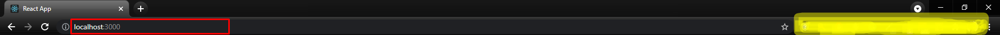
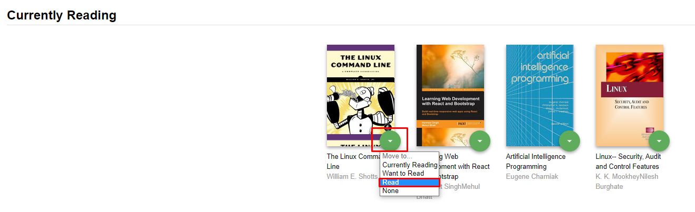
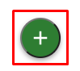
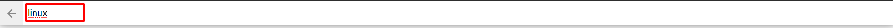
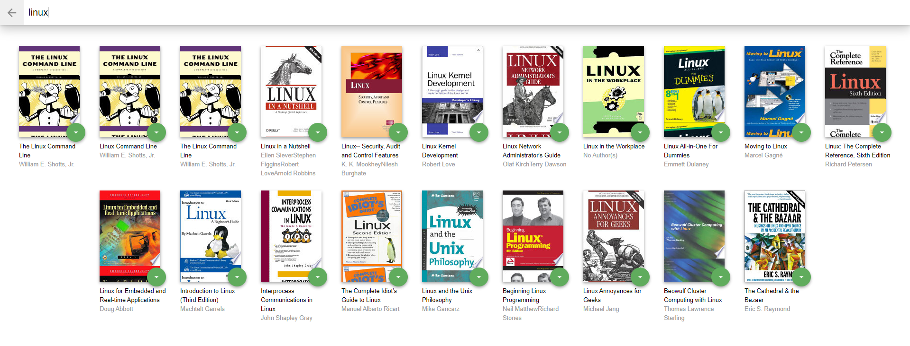

# MyReads

This is a project to showcase how states are handled in React coupled with how forms and inputs are handled through the concepts of controlled components.

## Essence of the App:

The App is a 1 project out of 3 in a path I am following at Udacity title React Nanodegree. It is intended to showcase how a whole App can be broken into components for reuseable and to adhere to DRY (Don't Repeat Yourself) and other principles.

## Loading the App

The project uses the Create-React-App in creating the starter template. 
The `create-react-app` command can be issued at your favourite command line tool only when Node is installed or you can use npm.

Clone the app from my GitHub repo using the command 
```git clone https://github.com/bafrimpong/myreads.git && npm install```

When all the dependencies are installed, launch the app with

```
npm start
```
OR
```
yarn start
```

Your default browser window will open showing the app contents. If it doesn't, just enter [http://localhost:3000/](http://localhost:3000/) in your browser to launch it.

## How to Use the App

- When the App starts by entering the addres , some default books are displayed on the main page with the books divided into one of the categories as `Currently Reading`, `Want to Read` and `Read`.
  

- The Books are segregated into 3 categories: Currently Reading aka `currentlyReading`, Want to Read aka `wantToRead` and Read aka `read`

- To move a book from a category (list) to another, click on the green button on the book cover
  

- To search for and add a new book, click on the green + button  at the bottom-right corner of the page.

- Enter an author's name or book title. 
  

- Up to atleast 20 books will be returned.


## Backend Server

To simplify your development process, we've provided a backend server for you to develop against. The provided file [`BooksAPI.js`](src/BooksAPI.js) contains the methods you will need to perform necessary operations on the backend:

* [`getAll`](#getall)
* [`update`](#update)
* [`search`](#search)

### `getAll`

Method Signature:

```js
getAll()
```

* Returns a Promise which resolves to a JSON object containing a collection of book objects.
* This collection represents the books currently in the bookshelves in your app.

### `update`

Method Signature:

```js
update(book, shelf)
```

* book: `<Object>` containing at minimum an `id` attribute
* shelf: `<String>` contains one of ["wantToRead", "currentlyReading", "read"]  
* Returns a Promise which resolves to a JSON object containing the response data of the POST request

### `search`

Method Signature:

```js
search(query)
```

* searchWord: `<String>`
* Returns a Promise which resolves to a JSON object containing a collection of a maximum of 20 book objects.
* These books do not know which shelf they are on. They are raw results only. You'll need to make sure that books have the correct state while on the search page.

### React Learning and Documentation:

React which is a product from Facebook has a great documentation repository where you can learn more about it just as I am doing. Have a great learning journey by visting any of the links below!

- [Create-react-app Documentation](https://github.com/facebookincubator/create-react-app)
- [React Router Documentation](http://knowbody.github.io/react-router-docs/)
- [React Training/React Router](https://reacttraining.com/react-router/web/api/BrowserRouter)
- [React API](https://facebook.github.io/react/docs/react-api.html)

### Helpful Project Resources:

If you are struggling to understanding some concepts and principles used in the App, please visit the links below to learn more.

- [Project starter template](https://github.com/udacity/reactnd-project-myreads-starter)
- [Project Rubric](https://review.udacity.com/#!/rubrics/918/view)
- [Udacity CSS Style Guide](http://udacity.github.io/frontend-nanodegree-styleguide/css.html)
- [Udacity HTML Style Guide](http://udacity.github.io/frontend-nanodegree-styleguide/index.html)
- [Udacity JavaScript Style Guide](http://udacity.github.io/frontend-nanodegree-styleguide/javascript.html)

#### Search Terms

The App is restricted to some search terms and so if for any reason, it's not all words or book titles entered into the textbox will return a good results. Below are the defined words which the search will return from the API endpoint in the App

More details can be found [here](SEARCH_TERMS.md);

